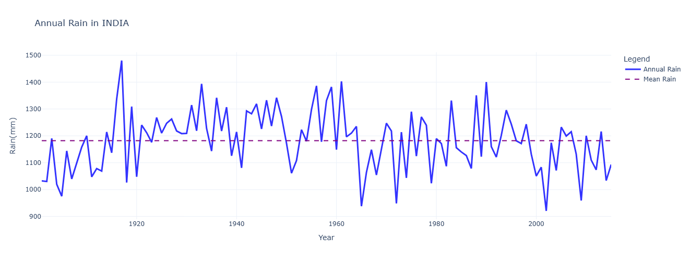
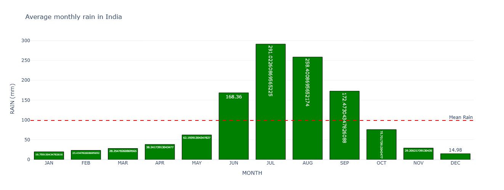

# 🌧️ Analysis of Long-Term Rainfall Patterns in India

## 📌 Project Overview

This project analyzes **India’s rainfall patterns over a long historical period** to understand variability, seasonality, extreme events (droughts and floods), and long-term trends. The study focuses on annual, monthly, and seasonal rainfall behavior, highlighting the dominant role of the monsoon and potential impacts of climate variability.

---

## 📊 Dataset Description

The dataset contains:
* **Annual rainfall (mm)**
* **Monthly rainfall distribution**
* **Seasonal rainfall (Monsoon, Post-monsoon, Winter, Pre-monsoon)**

The long time span enables detection of extreme events, rolling trends, and changing rainfall behavior.

---

## 📈 Annual Rainfall Variability

This graph shows significant year-to-year variability in India’s annual rainfall, with no apparent long-term upward or downward trend over the century. The red dashed line indicates the mean rainfall, around which the annual rainfall oscillates. Notable peaks and troughs highlight extreme rainfall events and dry years.



---

## 📅 Monthly Rainfall Distribution

This chart illustrates a highly uneven distribution of rainfall across months, July and August receive the highest average rainfall. The red dashed line represents the mean monthly rainfall, showing that most months receive rainfall below the average, except during the monsoon.



---

## 🌦️ Seasonal Rainfall Contribution

The seasonal breakdown highlights the **dominance of the monsoon season**, contributing roughly **890 mm** of rainfall annually.
Other seasons contribute significantly less, underscoring India’s strong dependence on monsoonal rainfall.


---

## 📉 Long-Term Trend (Rolling Average)

This graph shows **annual rainfall (blue)** and a **10-year rolling average (red)**.
While yearly rainfall fluctuates widely, the rolling average suggests a **slight downward trend after 1960**, possibly indicating climate-driven changes in rainfall distribution.


---

## 🚨 Extreme Events: Droughts & Flood Years

The analysis identifies:

* **Major drought years** (e.g., 1905, 1965, 2002, 2009)
* **Extreme rainfall years** (e.g., 1917, 1961, 1990)

These events are defined using deviations from mean annual rainfall and highlight climate extremes.


---

## ⚠️ Rainfall Anomalies

This graph highlights **significant rainfall anomalies**, with red points marking extreme deviations.
Most years cluster near the mean (green dashed line), while outliers reflect strong monsoonal variability and climate events.


---

## 🔗 Seasonal Correlation Analysis

Seasonal correlations with annual rainfall show:

* **Monsoon (Jun–Sep): 0.93** → strongest influence
* **Oct–Dec: 0.29** → moderate relationship
* **Jan–Feb: 0.14**, **Mar–May: 0.10** → weak correlations

This confirms the **monsoon as the primary driver** of India’s annual rainfall.


---

## 🧠 Clustering of Rainfall Years

Clustering categorizes years into **Dry, Normal, and Wet**:

* Most years fall under **Normal**
* **Wet years** are concentrated in early–mid 20th century
* **Dry years** appear more frequently in the latter half

This suggests a **possible shift in rainfall patterns** over time.


---

## 🔮 Rainfall Forecasting

The forecasting model shows:

* **Blue line:** predicted rainfall trend
* **Shaded region:** confidence interval
* **Black dots:** actual monthly data

The model captures variability well but indicates a **slight future decline in rainfall**, emphasizing the need for adaptive water-resource planning.


---

## ✅ Conclusion

* India’s rainfall is **highly variable and monsoon-dependent**
* No strong long-term annual trend, but **recent decades show lower rolling averages**
* Monsoon rainfall dominates annual totals and drives extremes
* Increasing dry-year frequency raises concerns for **water security and agriculture**

---

## 🛠️ Tools Used

* Python (Pandas, NumPy, Matplotlib, Statsmodels)
* Time-series analysis
* Rolling averages & anomaly detection
* Correlation & clustering
* Forecasting models

---

## 📌 Future Scope

* Include ENSO, IOD, and climate indices
* Regional/state-level rainfall analysis
* Advanced forecasting using ML models

---

### 🚀 Final Tip

After adding images:

```bash
git add README.md images/
git commit -m "Add rainfall analysis visuals"
git push
```

---

If you want, I can:

* Shorten this for **resume/GitHub recruiters**
* Add **figure numbering (Fig. 1, Fig. 2…)**
* Write a **project abstract**
* Convert this into a **report + README combo**

Just say what you want next 👌
