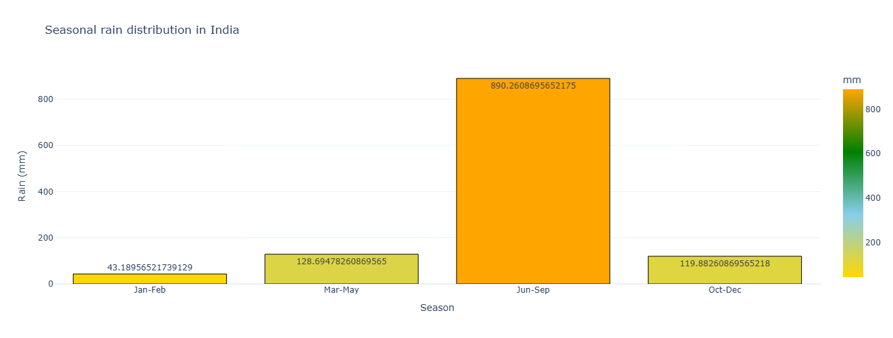
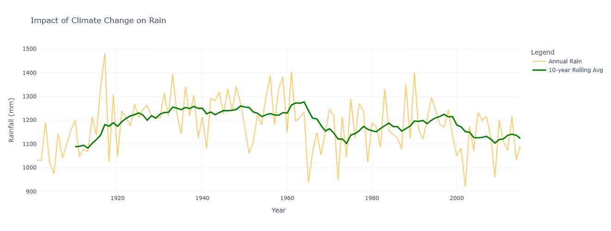
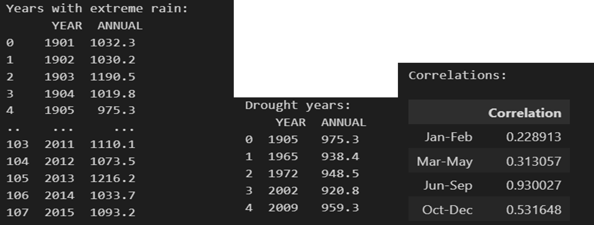
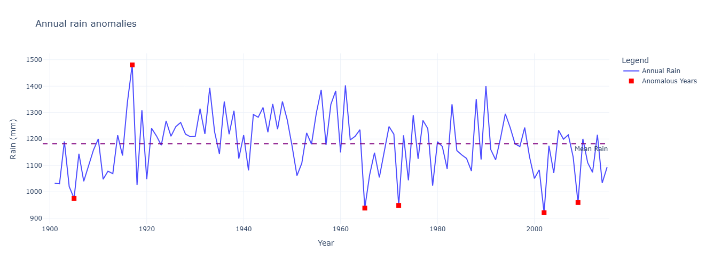
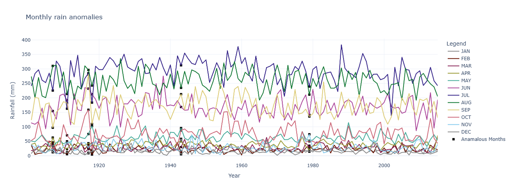
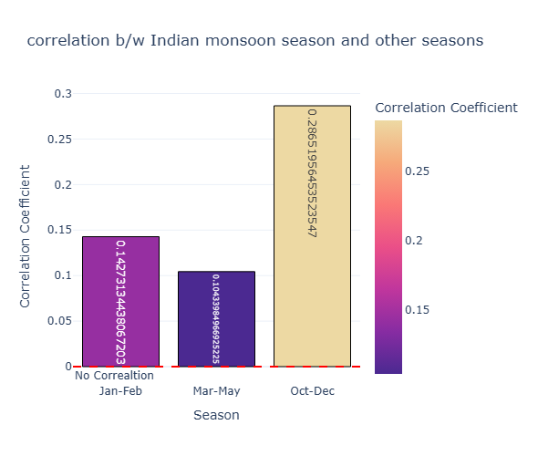
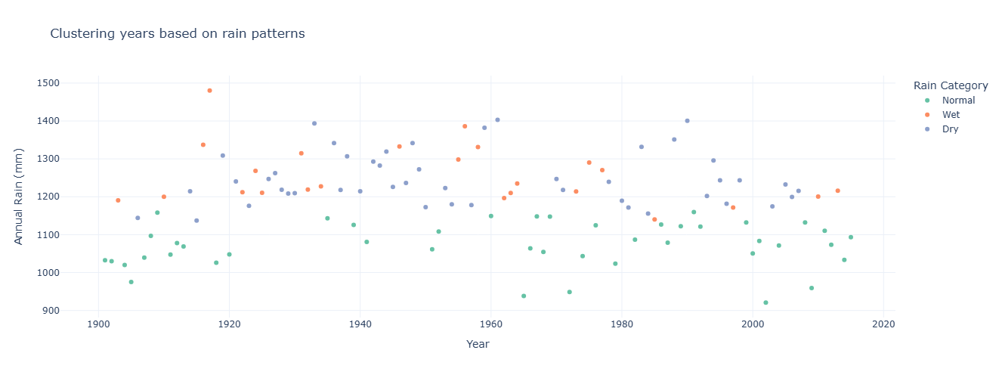
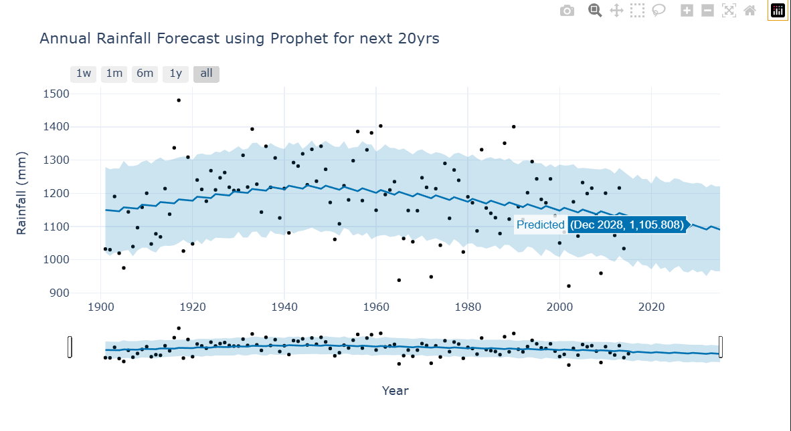

# 🌧️ Analysis of Long-Term Rainfall Patterns in India

## 📌 Project Overview

This project analyzes **India’s rainfall patterns over a long historical period** to understand variability, seasonality, extreme events (droughts and floods), and long-term trends. The study focuses on annual, monthly, and seasonal rainfall behavior, highlighting the dominant role of the monsoon and potential impacts of climate variability.

---

## 📊 Dataset Description

The dataset contains:
* **Annual rainfall (mm)**
* **Monthly rainfall distribution**
* **Seasonal rainfall (Monsoon, Post-monsoon, Winter, Pre-monsoon)**

The long time span enables detection of extreme events, rolling trends, and changing rainfall behavior.

---

## 📈 Annual Rainfall Variability

This graph shows significant year-to-year variability in India’s annual rainfall, with no apparent long-term upward or downward trend over the century. The red dashed line indicates the mean rainfall, around which the annual rainfall oscillates. Notable peaks and troughs highlight extreme rainfall events and dry years.

---

## 📅 Monthly Rainfall Distribution

This chart illustrates a highly uneven distribution of rainfall across months, July and August receive the highest average rainfall. The red dashed line represents the mean monthly rainfall, showing that most months receive rainfall below the average, except during the monsoon.

---

## 🌦️ Seasonal Rainfall Contribution

The seasonal distribution highlights the dominance of the monsoon season contributing the bulk of annual rainfall around 890 mm). In contrast, the other seasons contribute significantly less to the annual total, which emphasizes the critical role of the monsoon.

---

## 📉 Long-Term Trend (Rolling Average)

This graph shows the annual rainfall trends in India (blue line) and a 10-year rolling average (red line) to identify long-term patterns. While annual rainfall exhibits significant variability, the 10-year rolling average indicates a slight downward trend post-1960, which suggests a possible impact of climate change on rainfall distribution. Periods of higher averages in the early 20th-century contrast with more consistent but lower averages in recent decades.

---

## 🚨 Extreme Events: Droughts & Flood Years

The analysis identifies:

* **Major drought years** (e.g., 1905, 1965, 2002, 2009)
* **Extreme rainfall years** (e.g., 1917, 1961, 1990)

These events are defined using deviations from mean annual rainfall and highlight climate extremes.
Seasonal rainfall correlations with annual totals reveal that the monsoon season (June-September) has the strongest correlation (0.93), which indicates it predominantly drives annual rainfall patterns. 

---

## ⚠️ Rainfall Anomalies

This graph highlights years with significant rainfall anomalies, where annual rainfall deviated substantially from the mean. Drought years (e.g., 1905, 1965, 2002) and extreme rainfall years (e.g., 1917, 1961) are marked as red points, which showcase outliers in rainfall patterns. While most years cluster around the mean (green dashed line), the anomalies emphasize the variability in India’s rainfall, driven by factors like monsoonal fluctuations and climate events.

This graph highlights anomalies in non-monsoon months, while less frequent, highlight periods of unusual weather patterns, potentially linked to climate variability or regional disturbances. This graph supports the uneven distribution and high dependence on monsoonal rainfall for India’s water resources.

---

## 🔗 Seasonal Correlation Analysis

Seasonal correlations with annual rainfall show:

* **Monsoon (Jun–Sep): 0.93** → strongest influence
* **Oct–Dec: 0.29** → moderate relationship
* **Jan–Feb: 0.14**, **Mar–May: 0.10** → weak correlations

This confirms the **monsoon as the primary driver** of India’s annual rainfall.

---

## 🧠 Clustering of Rainfall Years

Clustering categorizes years into **Dry, Normal, and Wet**:

* Most years fall under **Normal**
* **Wet years** are concentrated in early–mid 20th century
* **Dry years** appear more frequently in the latter half

This suggests a **possible shift in rainfall patterns** over time.

---

## 🔮 Rainfall Forecasting

The forecasting model shows:

* **Blue line:** predicted rainfall trend
* **Shaded region:** confidence interval
* **Black dots:** actual monthly data

The model captures variability well but indicates a **slight future decline in rainfall**, emphasizing the need for adaptive water-resource planning.

---

## ✅ Conclusion

* India’s rainfall is **highly variable and monsoon-dependent**
* No strong long-term annual trend, but **recent decades show lower rolling averages**
* Monsoon rainfall dominates annual totals and drives extremes
* Increasing dry-year frequency raises concerns for **water security and agriculture**

---

## 🛠️ Tools Used

* Python (Pandas, NumPy, Matplotlib, Statsmodels)
* Time-series analysis
* Rolling averages & anomaly detection
* Correlation & clustering
* Forecasting models

---

## 📌 Future Scope
* Include ENSO, IOD, and climate indices
* Regional/state-level rainfall analysis
* Advanced forecasting using ML models
